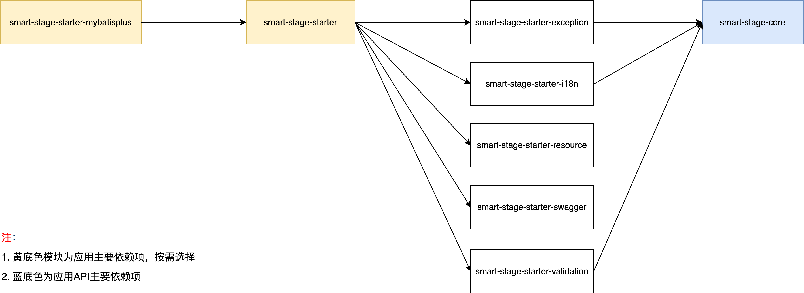

## 概述

### 简介

smart-stage是基于SpringBoot构建的微服务增强框架。它不仅统一了响应报文、异常、国际化、文档、校验等公共机制的处理规范，还引入了插件机制的新型开发方法。通过将其作为技术底座，应用前期可以将多个业务模块合并成单体应用部署启动。跟随业务的发展，无需修改代码的前提下，框架提供了将模块独立成微服务的能力，实现分阶降本增效。

### 组件介绍

  ```
smart-stage                                         应用名称
├── smart-stage-core                                核心模块，统一响应报文
├── smart-stage-starter-parent                      装配父模块
│   ├── smart-stage-starter-exception               异常模块，统一异常基类，拦截结果处理，国际化支持
│   ├── smart-stage-starter-i18n                    国际化模块，多国家语言处理
│   ├── smart-stage-starter-resource                资源模块，为应用加载合并资源配置文件，插件机制核心
│   ├── smart-stage-starter-swagger                 文档模块，Swagger规范
│   ├── smart-stage-starter-validation              校验模块，集成SpringBoot Validation，国际化支持
├── smart-stage-starter                             组装模块，SpringBoot Web基础和装配模块5大公共能力的组装
├── smart-stage-starter-mybatisplus                 组装扩展MybatisPlus模块，贯标公共字段及其变更自动赋值的功能
  ```

### 依赖关系



### 技术选型

| 技术                   | 版本    | 说明             |
| ---------------------- | ------- | ---------------- |
| spring-boot             | 2.5.13   | 容器+MVC框架     |
| spring-boot-starter-validation    | 2.5.13   | 校验  |
| druid-spring-boot-starter                | 1.2.8   | 数据库连接池          |
| mybatis-plus-boot-starter           | 3.5.2   | MyBatis增强工具  |
| springfox-boot-starter      | 3.0.0   | 文档     |

### 能力说明

1. **统一处理规范：** 实现了对响应报文、异常、国际化、文档、校验等公共机制的处理规范；

2. **ORM层标准化：** 提供了标准化ORM层公共字段及其变更自动赋值的功能；

3. **灵活部署支持：** 支持按业务垂直拆分的多模块应用，可按需选择单体或模块微服务的方式部署，在单体部署时，模块之间的API调用采用本地调用，而模块独立微服务方式下，自动切换成远程调用；

4. **插件机制：** 引入了插件机制，应用对插件的使用能够以插拔的方式完成实现切换，以适应不同项目和不同的交付场景；

5. **脚手架支持：** 提供了适用于不同需求场景的多款应用脚手架供选择，帮助用户快速上手；

6. **高度扩展性：** 装配模块的5大公共能力都是无耦合设计，任意模块的排除不影响其它模块的使用，且模块包含的装配Bean都允许自定义扩展覆盖，提升了系统的整体扩展性。

### 示例
示例工程[smart-stage-sample](https://github.com/a466350665/smart-stage-sample)
