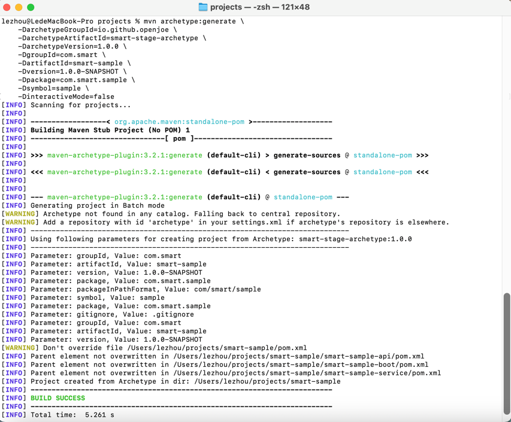
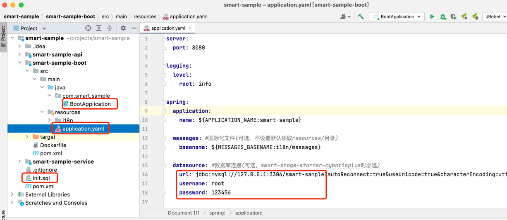
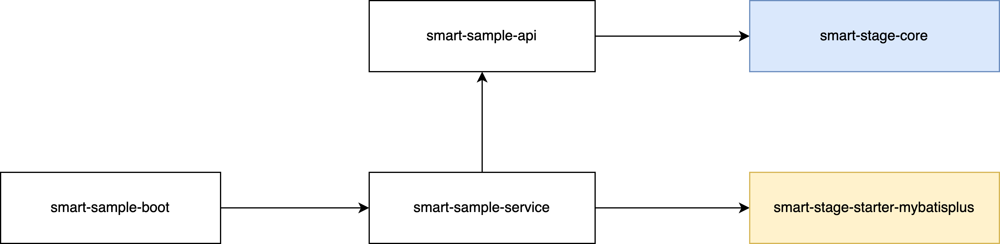

## 简介

smart-stage是一个构建在SpringBoot之上的微服务增强框架，其主要目标是为公共机制的处理提供规范。此外，它还引入了一种插件机制，使得应用的每个业务模块能够被抽象为一个微服务插件。这种设计不仅支持单个插件的启动，也兼顾了多个插件的组合启动。

## 组件说明

  ```
smart-stage                                         应用名称
├── smart-stage-core                                核心模块，统一响应报文
├── smart-stage-starter-parent                      装配父模块
│   ├── smart-stage-starter-exception               异常模块，统一异常基类，拦截结果处理，国际化支持
│   ├── smart-stage-starter-i18n                    国际化模块，多国家语言处理
│   ├── smart-stage-starter-resource                资源模块，为应用加载合并资源配置文件，插件机制核心
│   ├── smart-stage-starter-swagger                 文档模块，Swagger规范
│   ├── smart-stage-starter-validation              校验模块，集成SpringBoot Validation，国际化支持
├── smart-stage-starter                             组装模块，SpringBoot基础和装配模块5大公共能力的组装
├── smart-stage-starter-mybatisplus                 组装扩展MybatisPlus模块，贯标公共字段及其变更自动赋值的功能
  ```

## 组件依赖关系


## 技术选型

| 技术                   | 版本    | 说明             |
| ---------------------- | ------- | ---------------- |
| spring-boot             | 2.5.13   | 容器+MVC框架     |
| spring-boot-starter-validation    | 2.5.13   | 校验  |
| druid-spring-boot-starter                | 1.2.8   | 数据库连接池          |
| mybatis-plus-boot-starter           | 3.5.2   | MyBatis增强工具  |
| springfox-boot-starter      | 3.0.0   | 文档     |

## 能力说明

1. **统一处理规范：** 实现了对响应报文、异常、国际化、文档、校验等公共机制的处理规范；

2. **ORM层标准化：** 提供了标准化ORM层公共字段及其变更自动赋值的功能；

3. **灵活部署支持：** 支持按业务垂直拆分的多模块应用，可按需选择单体或模块微服务的方式部署，在单体部署时，模块之间的API调用采用本地调用，而模块独立微服务方式下，自动切换成远程调用；

4. **插件机制：** 引入了插件机制，应用对插件的使用能够以插拔的方式完成实现切换，以适应不同项目和不同的交付场景；

5. **脚手架支持：** 提供了适用于不同需求场景的多款应用脚手架供选择，帮助用户快速上手；

6. **高度扩展性：** 装配模块的5大公共能力都是无耦合设计，任意模块的排除不影响其它模块的使用，且模块包含的装配Bean都允许自定义扩展覆盖，提升了系统的整体扩展性。

## 快速开始

### 前置条件

该章节介绍如何使用smart-stage自带的Maven Archetype工具，快速创建一个推荐结构的SpringBoot + MybatisPlus + Mysql应用。这样的模块结构能同时兼容应用的单体启动及多应用的组合启动。在开始使用工具前，您需要确保本地已完成Maven环境的准备及环境变量的相关配置。

### 创建步骤
要创建一个新应用，请执行以下步骤：

1.终端cd指令定位到常用的workspace目录
```
cd /Users/lezhou/projects
```
2.执行以下Maven命令
```
mvn archetype:generate \
    -DarchetypeGroupId=io.github.openjoe \
    -DarchetypeArtifactId=smart-stage-archetype \
    -DarchetypeVersion=1.0.0 \
    -DgroupId=<my-groupId> \
    -DartifactId=<my-artifactId> \
    -Dversion=<my-version> \
    -Dpackage=<my-package> \
    -Dsymbol=<my-symbol> \
    -DinteractiveMode=false
```

请将上述命令中的&lt;my-groupId&gt;, &lt;my-artifactId&gt;, &lt;my-version&gt;, &lt;my-package&gt;, &lt;my-symbol&gt;替换为您的实际值。
<ul>
<li>
-DgroupId=&lt;my-groupId&gt;: 指定应用的组ID，如com.smart
</li>
<li>
-DartifactId=&lt;my-artifactId&gt;: 指定应用的artifact ID，如smart-sample
</li>
<li>
-Dversion=&lt;my-version&gt;: 指定应用的版本号，如1.0.0-SNAPSHOT
</li>
<li>
-Dpackage=&lt;my-package&gt;: 指定应用的Java包名，如com.smart.sample
</li>
<li>
-Dsymbol=&lt;my-symbol&gt;: 指定应用的简称，它用于请求路径前缀和插件资源目录的命名，最好用纯英文小写，如sample
</li>
</ul>

3.命令执行完成后，您将看到一个新的Maven应用目录。


4.用IDEA打开，找到<my-artifactId>-boot模块下的application.yaml文件修改成自己的数据库连接配置，并执行项目根路径下的初始化脚本init.sql，通过启动类BootApplication.java启动验证。


### 应用结构说明
```
<my-artifactId>                                应用名称
├── <my-artifactId>-api                        API模块，提供Feign接口示例
├── <my-artifactId>-service                    服务模块，提供基础CRUD示例，Controller、Service、Mapper结构分层
└── <my-artifactId>-boot                       启动模块，应用启动入口
  ```
&lt;my-artifactId&gt;为脚手架必传参数，创建后替换为您的实际值。

### 应用示例依赖关系



## 接入指南

### 添加依赖
在应用的公共模块中添加smart-stage-starter-mybatisplus依赖，无需数据库场景可以选择smart-stage-starter。
  ```
<dependency>
    <groupId>io.github.openjoe</groupId>
    <artifactId>smart-stage-starter-mybatisplus</artifactId>
    <version>${version}</version>
</dependency>
  ```

### 国际化
SpringBoot默认从项目的resources/目录读取，推荐存放resources/i18n目录。application.yaml标准配置如下：
```
spring:
  messages:
    basename: i18n/messages
```

资源文件配置示例：   
messages_zh_CN.properties
```
message.test1=国际化消息测试
message.test2=国际化消息测试,参数1：{0},参数2：{1}
  ```
messages_en_US.properties
```
message.test1=I18n message test
message.test2=I18n message test, param1:{0},param2:{1}
```

使用方式支持以下两种   
第一种：自定义枚举实现IMessage接口。(推荐)
```
import openjoe.smart.stage.common.core.entity.IMessage;

public enum MessageEnum implements IMessage {
    TEST1("message.test1"),
    TEST2("message.test2");

    private String key;
    
    MessageEnum(String key) {
        this.key = key;
    }

    @Override
    public String getKey() {
        return key;
    }
}

String test1 = MessageEnum.TEST1.getMessage();
String test2 = MessageEnum.TEST2.getMessage("p1", "p2");
  ```
第二种：直接使用Message工具类。
```
import openjoe.smart.stage.common.core.entity.Message;

String test1 = Message.get("message.test1");
String test2 = Message.get("message.test2", "p1", "p2");
  ```


请求头参数说明，国际化是前端通过在http请求头传递参数来告知后端当前使用的语言，推荐使用SpringBoot标准请求头Accept-Language。
```
Accept-Language:zh_CN
Accept-Language:en_US
```

### 异常处理
需国际化处理异常抛出ApplicationException，无需国际化处理抛出CommonException，自定义异常继承它俩即可。   
异常通常结合错误码一起使用，项目中请自定义错误码枚举，并实现IErrorCode接口。
```
import openjoe.smart.stage.common.core.entity.IErrorCode;
import openjoe.smart.stage.common.exception.ApplicationException;

public enum ErrorCodeEnum implements IErrorCode {

    E1001(1001, "主键不能为空"),
    E1002(1002, "编码：{0}已存在");

    private Integer code;
    private String desc;

    ErrorCodeEnum(Integer code, String desc) {
        this.code = code;
        this.desc = desc;
    }

    @Override
    public Integer getCode() {
        return code;
    }

    @Override
    public String getDesc() {
        return desc;
    }
}


public Result update(@RequestBody @Validated Demo entity) {
    if (entity.getId() == null) {
        throw new ApplicationException(ErrorCodeEnum.E1001);
    }
    Demo t = demoService.getByCode(entity.getCode());
    if (t != null && !t.getId().equals(entity.getId())) {
        throw new ApplicationException(ErrorCodeEnum.E1002, entity.getCode());
    }
    ......
    return Result.success();
}
```

错误码支持以枚举的code作为国际化key方式定义资源消息   
messages_zh_CN.properties
```
1001=主键不能为空
1002=编码：{0}已存在
```
messages_en_US.properties
```
1001=Id must not be null
1002=Code:{0} already exists
```

### 校验
Entity上增加javax.validation相关注解，Controller中Mapping方法增加@Validated注解。
```
import javax.validation.constraints.NotBlank;

@TableName("t_demo")
public class Demo extends BaseEntity {

    @NotBlank(message = "{demo.code}")
    private String code;

    @NotBlank
    private String name;
}

@PostMapping
public Result add(@RequestBody @Validated Demo entity) {
    demoService.save(entity);
    return Result.success();
}
```

校验也支持国际化处理，上述{demo.code}为国际化配置文件定义的key   
messages_zh_CN.properties
```
demo.code=编码不能为空
```
messages_en_US.properties
```
demo.code=Code must not be null
```

### 文档
使用了springfox-boot-starter工具，它内置Swagger，默认为开启状态。application.yml标准配置如下：
```
smart:
  stage:
    swagger:
      base-packages: com.smart.sample.controller #路径扫描,支持逗号分隔，不支持*模糊匹配
      title: smart-sample
      description: smart-sample描述
      version: 1.0.0-SNAPSHOT
```

禁用文档配置：
```
smart:
  stage:
    swagger:
      enable: false
```

### 扩展性
以smart-stage-starter为前缀的装配模块都是无耦合设计，任意模块的排除不影响其它模块的使用，且模块包含的装配Bean都允许自定义扩展覆盖，提升了系统的整体扩展性。

以下提供国际化装配模块的排除示例。
  ```
<dependency>
    <groupId>io.github.openjoe</groupId>
    <artifactId>smart-stage-starter-mybatisplus</artifactId>
    <exclusions>
        <exclusion>
            <groupId>io.github.openjoe</groupId>
            <artifactId>smart-stage-starter-i18n</artifactId>
        </exclusion>
    </exclusions>
</dependency>
  ```
